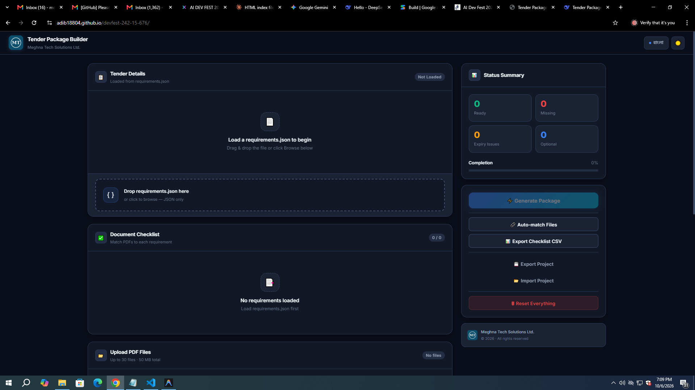
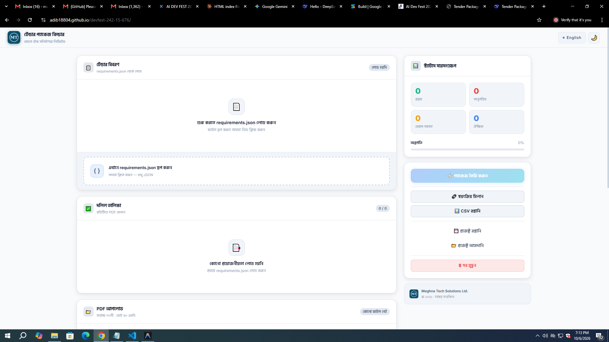
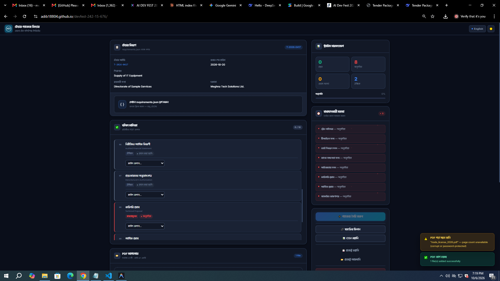
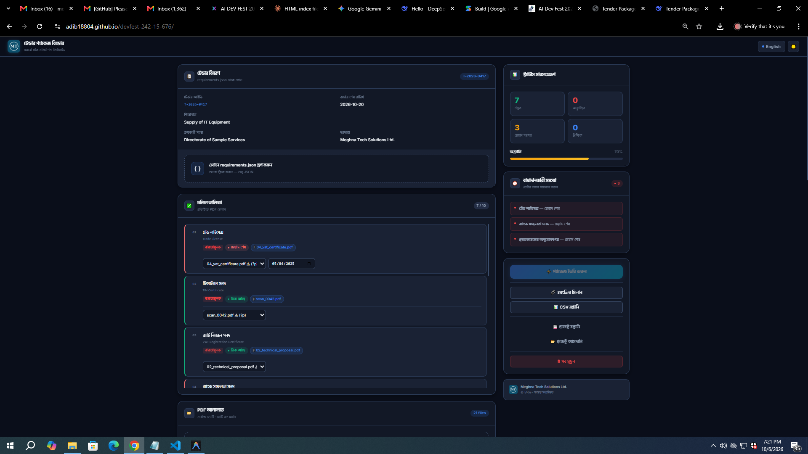

<div align="center">


# Tender Package Builder

**Participant:** Mohammad Adib Abtahi  
**Registration:** 242-15-676  
**Live site:** [https://adib18804.github.io/devfest-242-15-676/](https://adib18804.github.io/devfest-242-15-676/)  
**Repository:** [https://github.com/Adib18804/devfest-242-15-676](https://github.com/Adib18804/devfest-242-15-676)  

<p align="center">
  
</p>

</div>

---

## What it is
Tender Package Builder (TPB) is a professional, browser-only web application designed for office staff to validate, organize, match, and compile fragmented PDF documents into one single, compliant, sequentially ordered tender submission package. It features real-time validation across 5 document statuses, SHA-256 duplicate detection, expiry date verification against submission deadlines, automated bilingual support (English & বাংলা), and generates an official PDF complete with an authentic cover page, table of contents index, seal overlay, and dynamic per-page footer numbering.

---

## Live demo
Access the production application directly in any modern browser:  
[https://adib18804.github.io/devfest-242-15-676/](https://adib18804.github.io/devfest-242-15-676/)

---

## Running locally

```bash
git clone https://github.com/Adib18804/devfest-242-15-676.git
cd devfest-242-15-676
# Just open index.html in Chrome — no build step needed
```

---

## How to use

| Action | User Interaction | Expected Result |
|---|---|---|
| **Load Tender Requirements** | Drag & drop or browse `requirements.json` onto the top card | Validates JSON schema; populates tender details (Tender ID, deadline, title, procuring entity, bidder) and orders checklist items |
| **Upload Source PDFs** | Drag & drop or browse multiple PDF files into upload zone | Files are validated, page counts extracted via PDF.js, and SHA-256 hashes generated |
| **Duplicate Detection** | Upload duplicate or renamed files with matching content | Files with identical content hash are marked with a `Duplicate` badge and blocked from matching different requirements |
| **Match Documents** | Select an uploaded PDF from each requirement's dropdown | Enforces strict 1-to-1 matching; matched files are displayed with interactive tags and can be changed/undone anytime |
| **Input Expiry Dates** | Pick dates for requirements marked `has_expiry: true` | Validates date against deadline; same-day or future dates pass (`OK`), past dates trigger `Expired` blocking error |
| **Auto-match Files** | Click `🔗 Auto-match Files` button in sidebar | Performs fuzzy token scoring between file names and English/Bengali titles, offering a confirmation dialog |
| **Apply Digital Seal** | Upload PNG seal and select specific pages in the checklist | Digitally overlays the seal image at the bottom-right of chosen pages |
| **Generate Combined PDF** | Click `⚡ Generate Package` once all blocking issues resolve | Generates an official PDF with Page 1 Cover (with 80x80pt company logo), Page 2 Index, merged documents, and per-page footer |
| **Download Output** | Click `⬇ Download PDF` | Downloads compiled package named `<tender_id>_Package.pdf` |

---

## Implemented features

### Main tasks (from problem statement)
- ☑ **4.1 Load requirements.json** — File picker + drag-and-drop with strict schema validation and clear descriptive errors.
- ☑ **4.2 Tender details & ordered document list** — Displays all tender metadata and checklist sorted strictly by `order`.
- ☑ **4.3 Multiple PDF upload & management** — Filename + page count display, individual file removal, and non-PDF rejection.
- ☑ **4.4 1-to-1 document matching** — Flexible 1-to-1 matching with instant change and undo capabilities.
- ☑ **4.5 Dynamic expiry date inputs** — Conditionally displayed only when `has_expiry: true` and a file is matched.
- ☑ **4.6 Real-time 5-state document status engine:**
  - *Missing* (mandatory, no file) → Blocks generation
  - *Expiry date needed* (has_expiry, file, no date) → Blocks generation
  - *Expired* (expiry < deadline) → Blocks generation
  - *Not provided* (optional, no file) → Does not block
  - *OK* (file + valid expiry, expiry == deadline is OK) → Passes
- ☑ **4.7 SHA-256 duplicate content detection** — Computes cryptographic hashes via Web Crypto API, flags duplicates, and prevents cross-matching.
- ☑ **4.8 Reactive generation blocker** — Generate button disabled while blocking problems exist, displaying an itemized issue tracker.
- ☑ **4.9 Complete combined PDF generation:**
  - Page 1: Official English cover page with `company_logo.png`, tender ID, title, procuring entity, bidder, submission deadline, generation date, and included documents list.
  - Page 2: Structured Index table of contents with accurate starting page numbers.
  - Document sequence: Embedded in exact requirement order (missing optional docs skipped).
  - Every page: Standardized centered footer `<tender_id> | Page X of Y` in 10pt gray without obscuring content.
- ☑ **4.10 Direct file download** — Generates and downloads `<tender_id>_Package.pdf`.
- ☑ **4.11 Bilingual UI toggle** — Instant toggle between English and বাংলা across all UI headers, labels, buttons, and document titles.
- ☑ **4.12 Persistent dark / light theme** — Elegant theme toggle persisted in `localStorage`.
- ☑ **4.13 Complete session persistence** — Automatically synchronizes state to `localStorage` under `tender-builder-v1`.

### Bonus tasks (from problem statement)
- ☑ **Bonus 1: Dynamic Index / TOC Page** — Automated table (# | Document Title | Start Page | Pages) inserted right after the cover.
- ☑ **Bonus 2: Digital Seal & Signature Overlay** — Upload seal PNG/JPG with multi-select checkboxes for overlay at bottom-right of selected pages.
- ☑ **Bonus 3: CSV Checklist Export** — Exports checklist with UTF-8 BOM (`\uFEFF`) to preserve flawless Bangla script rendering in Microsoft Excel.
- ☑ **Bonus 4: Project Save & Reopen** — Instant auto-saving plus full Export/Import Project as formatted JSON.
- ☑ **Bonus 5: Bangla Text in PDF Cover** — Gracefully attempts dual-language rendering with automatic standard font fallback.
- ☑ **Bonus 6: Fuzzy Token Auto-match** — Intelligent token matching comparing filename keywords against requirement titles with confirmation prompt.
- ☑ **Bonus 7: Resilient File Parsing** — Corrupt, encrypted, or password-protected PDFs trigger friendly warnings while safely keeping the file with a `?` page placeholder.
- ☑ **Bonus 8: AI Tender Assistant** — Interactive AI modal offering automated compliance readiness auditing and custom API key support.

### Extra features
- ☑ **Dark / Light theme persistence** — Smooth transition between curated dark (`#0a0e1a`) and light (`#f8fafc`) palettes.
- ☑ **Keyboard shortcuts** — `Esc` dismisses modals and notifications; `Alt+R` / `Ctrl+R` triggers project reset with confirmation.
- ☑ **Micro-animated toast system** — Accessible notifications with success, error, warning, and info visual feedback.
- ☑ **Fully responsive enterprise layout** — 2-column desktop view, collapsible sticky sidebar, and single-column mobile view.
- ☑ **Session restore notifications** — Informs users on reload and guides them to re-verify or re-upload files.

---

## Screenshots

| Header + Main UI | Document Statuses |
|:---:|:---:|
| [](screenshots/ss1.png) | [](screenshots/ss2.png) |
| *Header, Tender Details & Dropzones* | *Document Status Badges & Issue Tracker* |

| Bangla UI | Generated PDF |
|:---:|:---:|
| [](screenshots/ss3.png) | [](screenshots/ss4.png) |
| *Bilingual Interface (বাংলা)* | *Generated PDF Cover Page & Packaging* |

<br />

### Detailed Visual Previews

#### 1. Header + Main UI


#### 2. Document Statuses


#### 3. Bangla UI


#### 4. Generated PDF


---

## Sample checks (from problem statement)

| Scenario | Action | Expected | Result |
|---|---|---|:---:|
| **All documents valid** | Match all files + valid expiries | Package generates cleanly | ✅ |
| **Expired trade license** | Match trade_license_2025.pdf | Status: Expired (Blocks generation) | ✅ |
| **Duplicate files** | Upload experience_cert.pdf + experience_cert (1).pdf | Marked duplicate, prevented cross-match | ✅ |
| **Missing mandatory** | Skip R01 (Trade License) | Generate disabled; listed in blocking issues | ✅ |
| **Optional missing** | Skip R06 (Audited Financial Statement), R07 | Generate remains enabled | ✅ |

---

## Tech

- **Vanilla HTML5 + CSS3 + Modern JavaScript (ES2022)** — 100% frontend, zero build steps, zero external frameworks.
- **pdf-lib (v1.17.1)** — In-browser PDF generation, vector rendering, image embedding, page merging, and footer stamping.
- **pdfjs-dist (v3.11.174)** — Client-side PDF parsing and page count extraction.
- **Web Crypto API** — Cryptographic SHA-256 content hashing for duplicate identification.
- **localStorage API** — Client-side state persistence across reloads (`tender-builder-v1`).
- **GitHub Pages** — Static deployment directly from GitHub repository.
- **Zero backend, zero external database, zero secrets.**

---

## Known problems

- **Bangla text in PDF cover:** Standard PDF fonts (WinAnsi encoding) do not natively embed Bengali Unicode glyphs; the app gracefully falls back to clear English titles with dual display in the browser UI.
- **Very large PDFs (> 10 MB each):** Client-side buffer extraction and merging in browser memory may take 2-4 seconds to process.
- **Seal placement:** Uses an enterprise-standard fixed bottom-right position (offset 32pt from bottom, 105pt from right margin).

---

## AI tools and best prompt

**AI tool used:** Google Antigravity + Claude (Anthropic)  
**Most useful prompt:**  
> "Build a production-quality Tender Package Builder web app. Frontend-only, vanilla HTML/CSS/JS in 3 files. Load requirements.json, upload PDFs with SHA-256 duplicate detection, match 1-to-1, track expiry dates with 5 real-time statuses, generate a combined PDF with cover page + index + per-page footer '<tender_id> | Page X of Y'. Include Bangla + English toggle, dark/light theme, CSV export, project save/restore, auto-match by filename, and safe handling of corrupt PDFs. Use company_logo.png in header, sidebar, and PDF cover."

> "You are a senior frontend engineer + UI/UX designer. I need you to build a 
production-quality Tender Package Builder web app. Design quality matters 
because judges will compare many submissions and I want mine to stand out.

═══════════════════════════════════════════════════════════
STRICT CONSTRAINTS
═══════════════════════════════════════════════════════════
- FRONTEND ONLY. No backend, no serverless, no database.
- All processing happens in the browser.
- Single index.html file. No framework, no build step.
- Vanilla HTML + CSS + JavaScript only.
- CDN libraries allowed (see tech stack below).
- No secrets, no API keys in code.
- Must run in latest Google Chrome.
- Works offline after first load (fonts cached).

═══════════════════════════════════════════════════════════
DESIGN PHILOSOPHY
═══════════════════════════════════════════════════════════
- Modern, professional, enterprise-grade look (like Stripe, Linear, Vercel)
- Clean typography, generous whitespace, subtle shadows
- Dark theme by default with a polished light theme toggle
- Smooth micro-animations (150-250ms), never flashy
- Accessible: high contrast, keyboard focus rings, ARIA labels
- Fully responsive: desktop 2-column, mobile single-column
- Zero UI libraries — vanilla CSS only, hand-crafted

═══════════════════════════════════════════════════════════
TECH STACK
═══════════════════════════════════════════════════════════
- Single index.html file
- Vanilla HTML + CSS + JavaScript
- CDN libraries:
  * pdf-lib: https://cdn.jsdelivr.net/npm/pdf-lib@1.17.1/dist/pdf-lib.min.js
  * pdfjs-dist: https://cdn.jsdelivr.net/npm/pdfjs-dist@3.11.174/build/pdf.min.js
  * pdfjs worker: https://cdn.jsdelivr.net/npm/pdfjs-dist@3.11.0/build/pdf.worker.min.js
- Google Fonts:
  * Inter — https://fonts.googleapis.com/css2?family=Inter:wght@400;500;600;700;800
  * Hind Siliguri — https://fonts.googleapis.com/css2?family=Hind+Siliguri:wght@400;500;600;700
- localStorage key: "tender-builder-v1"

═══════════════════════════════════════════════════════════
COMPANY LOGO REQUIREMENT (IMPORTANT)
═══════════════════════════════════════════════════════════
The app MUST prominently display a company logo:

1. In the header (top-left), show a logo mark:
   - A rounded square (40x40px) with a gradient background 
     (linear-gradient(135deg, #3b82f6 0%, #06b6d4 100%))
   - Inside the square: the letters "TPB" in white, bold, 16px
   - Next to it: the app title "Tender Package Builder"

2. On the PDF cover page (generated via pdf-lib), draw the SAME logo:
   - Blue rounded rectangle at top-left (80x80pt)
   - White "TPB" text centered inside
   - Company name "Meghna Tech Solutions Ltd." below
   - This makes the generated PDF look official and professional

3. In the README (I'll ask later), reference the logo.

The logo is a placeholder — no external image file needed. Use CSS 
gradient + text. Keep it consistent across header + PDF.

═══════════════════════════════════════════════════════════
THE PROBLEM
═══════════════════════════════════════════════════════════
Build an app that helps office staff turn a set of PDF files into one 
complete, checked, ordered PDF package for a tender submission.

SAMPLE requirements.json:
{
  "tender": {
    "tender_id": "T-2026-0417",
    "title": "Supply of IT Equipment",
    "procuring_entity": "Directorate of Sample Services",
    "bidder": "Meghna Tech Solutions Ltd.",
    "submission_deadline": "2026-10-20"
  },
  "requirements": [
    { "id": "R01", "order": 1, "title_en": "Trade License", "title_bn": "ট্রেড লাইসেন্স", "mandatory": true, "has_expiry": true },
    { "id": "R02", "order": 2, "title_en": "TIN Certificate", "title_bn": "টিআইএন সনদ", "mandatory": true, "has_expiry": false },
    { "id": "R03", "order": 3, "title_en": "VAT Registration Certificate", "title_bn": "ভ্যাট নিবন্ধন সনদ", "mandatory": true, "has_expiry": false },
    { "id": "R04", "order": 4, "title_en": "Bank Solvency Certificate", "title_bn": "ব্যাংক সচ্ছলতা সনদ", "mandatory": true, "has_expiry": true },
    { "id": "R05", "order": 5, "title_en": "Experience Certificate", "title_bn": "অভিজ্ঞতার সনদ", "mandatory": true, "has_expiry": false },
    { "id": "R06", "order": 6, "title_en": "Audited Financial Statement", "title_bn": "নিরীক্ষিত আর্থিক বিবরণী", "mandatory": false, "has_expiry": false },
    { "id": "R07", "order": 7, "title_en": "Manufacturer's Authorization", "title_bn": "প্রস্তুতকারকের অনুমোদনপত্র", "mandatory": false, "has_expiry": true },
    { "id": "R08", "order": 8, "title_en": "Technical Proposal", "title_bn": "কারিগরি প্রস্তাব", "mandatory": true, "has_expiry": false },
    { "id": "R09", "order": 9, "title_en": "Financial Proposal", "title_bn": "আর্থিক প্রস্তাব", "mandatory": true, "has_expiry": false },
    { "id": "R10", "order": 10, "title_en": "Signed Declaration", "title_bn": "স্বাক্ষরিত ঘোষণাপত্র", "mandatory": true, "has_expiry": false }
  ]
}

═══════════════════════════════════════════════════════════
TIER 1 — MAIN TASKS (must all work — priority order)
═══════════════════════════════════════════════════════════
4.1 Load requirements.json (file picker + drag-drop)
4.2 Show tender details + document list sorted by order
4.3 Upload multiple PDFs → show filename + page count → remove any file
4.4 Match 1-to-1 (document ↔ file). Change or undo anytime
4.5 Expiry date input for documents with has_expiry=true
4.6 Real-time status per document:
    - Missing (mandatory, no file) → BLOCKS
    - Expiry date needed (has_expiry, file matched, no date) → BLOCKS
    - Expired (expiry < deadline) → BLOCKS
    - Not provided (optional, no file) → does NOT block
    - OK (file matched, and if has_expiry, expiry >= deadline)
    - Expiry == deadline = OK
4.7 Duplicate detection (SHA-256 content hash) — mark duplicates, 
    prevent matching them to different documents
4.8 Generate button disabled while blocking status; show WHY
4.9 Generate combined PDF:
    - Page 1: Cover page in English with logo, tender ID, title, entity, 
      bidder, deadline, date made, list of included documents in order
    - Then all documents sorted by order (skip optional missing)
    - Every page (including cover) has footer: 
      "<tender_id> | Page X of Y"
    - Footer: 10pt gray, centered at bottom, must NOT cover content
4.10 Download as <tender_id>_Package.pdf
4.11 Language toggle (English / বাংলা) — all UI labels + document titles
4.12 Theme toggle (Dark / Light)
4.13 localStorage save/restore

═══════════════════════════════════════════════════════════
BONUS TASKS (Section 7 — do after all main tasks work)
═══════════════════════════════════════════════════════════

Bonus 1: Index page after the cover
  - A page inserted AFTER page 1 (cover)
  - Shows a table: # | Document Title | Starting Page in Package
  - Title: "Index" (English) / "সূচিপত্র" (Bangla)
  - Must be included in total page count Y in footer

Bonus 2: Seal / Signature
  - User uploads a PNG image
  - User selects which pages get the seal (multi-checkbox)
  - The PNG is overlaid at bottom-right of each chosen page
  - Must not cover document content

Bonus 3: Export checklist as CSV
  - Button in sidebar
  - Generates CSV with columns: Document ID, Document Title, File Name, 
    Pages, Expiry Date, Status
  - Downloads as "checklist.csv"
  - UTF-8 BOM for Excel compatibility (Bangla text)

Bonus 4: Save/Reopen work
  - Auto-save to localStorage on every change
  - On load, if a saved state exists, restore it
  - Also: "Export Project" button → downloads JSON file with entire state
  - "Import Project" button → loads a JSON file to restore state

Bonus 5: Bangla text in PDF (skip if running low on time)
  - Cover page shows title_bn for included documents under the English 
    title, in a smaller gray font
  - Use pdf-lib's StandardFonts; if Bangla not supported, skip gracefully

Bonus 6: Auto-match by filename
  - Button: "Auto-match" in sidebar
  - Analyze filenames: "trade_license_2026.pdf" → R01 (Trade License)
  - Uses fuzzy matching (normalize: lowercase, remove spaces/underscores, 
    compare tokens)
  - Shows a preview: "Suggested 8 matches, apply?" → Confirm dialog → Apply

Bonus 7: Handle bad files safely
  - Try/catch around all PDF parsing
  - If PDF is corrupt or password-protected: show error toast, skip file
  - If page count fails: show "?" for pages, still allow matching

Bonus 8: AI help using user's own API key (skip if near T+88)
  - Input field for user's own Anthropic API key (never stored in code)
  - Store key only in sessionStorage (not localStorage, not in repo)
  - Feature: "Suggest matches using AI" → sends filenames + requirement 
    titles to Claude API → returns suggestions

═══════════════════════════════════════════════════════════
VISUAL DESIGN SPEC
═══════════════════════════════════════════════════════════

COLOR PALETTE (dark theme — use CSS variables):
--bg: #0a0e1a
--surface: #121826
--surface-2: #1a2234
--surface-3: #232d45
--border: #2a3a56
--border-strong: #3b4d6b
--text: #f1f5f9
--text-muted: #94a3b8
--text-subtle: #64748b
--accent: #3b82f6
--accent-hover: #2563eb
--accent-glow: rgba(59,130,246,0.25)

STATUS COLORS:
--status-ok: #10b981
--status-missing: #ef4444
--status-expiry-needed: #f59e0b
--status-expired: #991b1b
--status-not-provided: #64748b

SHADOWS:
--shadow-sm: 0 1px 2px rgba(0,0,0,0.3)
--shadow-md: 0 4px 12px rgba(0,0,0,0.35)
--shadow-lg: 0 12px 32px rgba(0,0,0,0.45)
--shadow-glow: 0 0 24px rgba(59,130,246,0.15)

RADIUS:
--radius-sm: 8px
--radius-md: 12px
--radius-lg: 16px
--radius-xl: 20px

LIGHT THEME OVERRIDES:
--bg: #f8fafc
--surface: #ffffff
--surface-2: #f1f5f9
--surface-3: #e2e8f0
--border: #e2e8f0
--text: #0f172a
--text-muted: #64748b

TYPOGRAPHY:
- Font: 'Inter', 'Hind Siliguri', system-ui, sans-serif
- Base size: 14px, line-height: 1.6
- Headings: font-weight 700-800, letter-spacing -0.02em
- Monospace: 'JetBrains Mono', 'Consolas', monospace

LAYOUT:
- Header: sticky 64px, backdrop-filter blur(12px), subtle border-bottom
- Main grid: 2 columns — left flexible (min 640px), right sidebar 400px
- Mobile (< 1024px): single column
- Padding: 20px sections, 24px container

═══════════════════════════════════════════════════════════
i18n STRUCTURE
═══════════════════════════════════════════════════════════
- All text via data-i18n="key"
- I18N object: { en: {...}, bn: {...} }
- Document titles: title_en or title_bn based on language
- All labels, buttons, statuses, errors, instructions bilingual

═══════════════════════════════════════════════════════════
WORKFLOW
═══════════════════════════════════════════════════════════
1. ONE step at a time
2. Return ONLY the code I need to add
3. Never rewrite the whole file
4. When I paste an error, fix ONLY that
5. When I say "next", proceed to next step
6. No explanations — timed contest

PRIORITY ORDER:
Step 1: HTML skeleton + full CSS + i18n + header (with logo) + 
        2-column layout + all cards
Step 2: Load requirements.json + validation + render document list
Step 3: Upload PDFs + page count + remove + duplicate detection
Step 4: Match files + expiry input + status computation
Step 5: Generate PDF (cover with logo + index + documents + footer) 
        + download
Step 6: Bonus 1 (index page), Bonus 3 (CSV), Bonus 4 (save) 
Step 7: Bonus 6 (auto-match), Bonus 7 (bad files)
Step 8: Language + theme polish + final touches

═══════════════════════════════════════════════════════════
FIRST RESPONSE — Step 1 ONLY
═══════════════════════════════════════════════════════════
Give me the COMPLETE index.html for Step 1:

- Full <head> with meta tags, Google Fonts links, pdf-lib + pdfjs CDN
- Complete CSS:
  * CSS variables for both themes
  * Reset + base typography
  * Header (64px, logo mark TPB with gradient, title, theme toggle, 
    language toggle)
  * Cards (surface, border, shadow, radius)
  * Buttons (primary, secondary, ghost, disabled states)
  * Status badges (5 colors)
  * Toast notifications
  * Dropzone (dashed border, hover/drag states)
  * File rows
  * Progress bar
  * Micro-animations (fadeIn, slideUp, pulse, glow)
  * Responsive breakpoints
  * Focus-visible outlines
- Complete HTML body:
  * Header: logo mark (gradient square with "TPB") + "Tender Package 
    Builder" title + theme toggle + language toggle
  * Main grid: left column + right sidebar
  * Left column:
    - Tender Details Card (empty)
    - Document Checklist Card (empty list, header with progress badge)
    - Upload Dropzone
    - Uploaded Files List
  * Right sidebar:
    - Status Summary Card (with progress bar)
    - Blocking Problems Card (hidden by default)
    - Action buttons: Generate (disabled), Download (hidden), 
      Auto-match, Export CSV, Export Project, Import Project, Reset
    - Logo footer (small TPB logo + copyright)
  * Toast container
- Empty <script>:
  * I18N object (en + bn) with ALL keys
  * LANG = "en"
  * t() helper
  * applyLanguage()
  * Theme toggle logic
  * Language toggle logic
  * localStorage key definition
  * Comment: "// logic added in next steps"

The Step 1 file MUST:
- Look STUNNING in Chrome (even with empty content)
- Show header with TPB logo, both columns, all cards
- Language toggle works (EN ↔ BN text switches)
- Theme toggle works (dark ↔ light)
- No console errors
- Fully responsive"


---

## License

MIT — see [LICENSE](./LICENSE).
